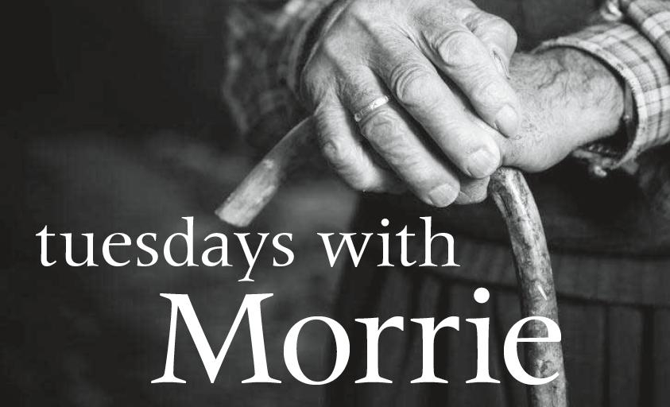

# Tuesdays with Morrie: a review

You hardly come across a book which is simple yet compelling, a quick-read yet thought-provoking, saddening yet heartening, short yet long lasting. Tuesdays with Morrie by Mitch Albom is one such masterpiece. More than just a memoir of last words of a dying man, it's an inspirational account of a man's life - a man whose passion for the human spirit has continued to live long after his last breath.

Albom is an author who makes one say 'I love you' more often, not just to your family but to yourself. His books have made me cry, realize the importance of life, and has humbled me. This book, in particular, has got something for everyone.

The book is a story of a 'coach' and his 'player'. Sixteen years after graduation, Mitch learns that his sociology professor Morrie Schwartz has amyotrophic lateral sclerosis (ALS), Lou Gehrig's disease: a brutal neurological illness. The unexpected reunion of the two rejuvenates the relationship and the last project for the old man begins - his own death.

The class is held every tuesday and the topic of the class: The Meaning Of Life. Every Tuesday, Mitch sees his professor's condition worsening and that Morrie shows no signs to quit. Such fourteen tuesdays spent with Morrie turn out to be a magical chronicle that helped not just Mitch, but the world, find the meaning of life.

I found this book in a list of ‘Books You Shouldn’t Leave College Without Reading’. It had been in my reading list for long before I finally decided to read it. Though it turned out to be a very quick read, there were assertions that made me think for a little while a few others made me ponder longer. I quote some of Morrie's wisdom:
"Dying is only one thing to be sad over, Mitch. Living unhappily is something else."
"We think we don't deserve love, we think if we let it in we'll become too soft. But a wise man named Levine said it right. He said." Love is the only rational act.”
“The truth is, once you learn how to die, you learn how to live.”
“The culture we have does not make people feel good about themselves. And you have to be strong enough to say if the culture doesn’t work, don’t buy it.”

Of course, I can’t quote everything Morrie had to say for the size of the post is a constraint; grab a copy and find out which ones of Morrie’s assertions makes you ‘ponder for a little longer’. 
